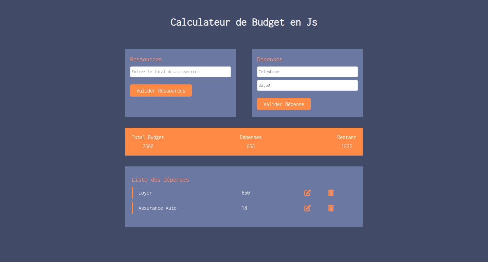

# Calculateur de Budget

## Description

Le Calculateur de Budget est une application web simple qui permet de gérer et de suivre vos ressources financières. Grâce à cette application, vous pouvez entrer vos ressources totales, ajouter des dépenses et voir le montant restant de vos ressources en temps réel.

## Fonctionnalités

- **Entrée des ressources** : Ajoutez le montant total de vos ressources.
- **Ajout de dépenses** : Ajoutez des dépenses avec un titre et un coût.
- **Calcul automatique** : Le montant restant de vos ressources est calculé automatiquement après chaque ajout de dépense.
- **Liste des dépenses** : Visualisez toutes vos dépenses dans une liste.
- **Modification et suppression** : Modifiez ou supprimez des dépenses existantes.

## Technologies utilisées
- **HTML** : Structure de la page web.
- **CSS** : Styles et mise en page.
- **JavaScript** : Logique de l'application et interactions utilisateur.

## Aperçu



## Installation

1. Clonez le dépôt sur votre machine locale :
    ```sh
    git clone https://github.com/Github-MitchD/calculateurBudgetJs.git
    ```
2. Ouvrez le fichier `index.html` dans votre navigateur pour voir le Calculateur de Budget en action.

## Structure du Projet

- `index.html` : Le fichier HTML principal contenant la structure de la page.
- `style.css` : Fichier CSS pour les styles personnalisés.
- `script.js` : Fichier JavaScript contenant la logique pour générer et afficher les citations.
- `README.md` : Ce fichier, décrivant le projet.

## Dépendances

- <a href="https://getbootstrap.com/" target="_blank">Bootstrap 5.2.0</a>
- <a href="https://fonts.google.com/specimen/Inconsolata" target="_blank">Google Fonts - Inconsolata</a>

## Utilisation

1. Entrez le montant total de vos ressources dans le champ "Entrez le total des ressources" et cliquez sur "Valider Ressources".
2. Ajoutez une dépense en entrant un titre et un coût, puis cliquez sur "Valider Dépense".
3. La liste des dépenses sera mise à jour et le montant restant de vos ressources sera affiché.

## Auteur

- <a href="https://micheldufour.fr" target="_blank">Michel Dufour - Développeur Web</a>

## Licence

Ce projet est sous licence MIT. Voir le fichier [LICENSE](LICENSE) pour plus de détails.